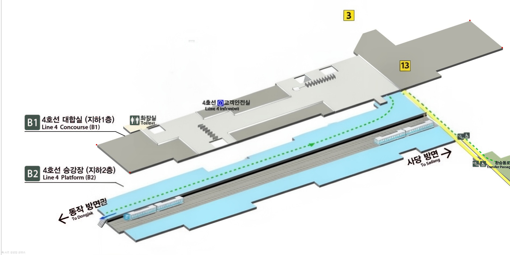
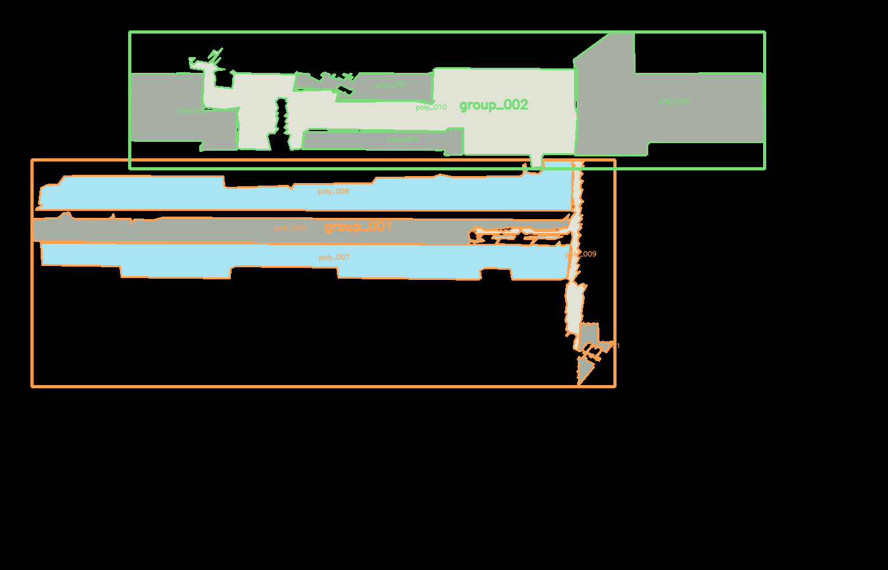

# 아이소메트릭 지하철 도면 폴리곤 추출

OpenCV 기반으로 아이소메트릭 2D 지하철 안내도에서 바닥 폴리곤을 추출하는 파이프라인입니다.

전체 이미지를 warp하지 않고, 추출된 폴리곤 꼭짓점만 `perspectiveTransform`으로 정사영한 뒤 `auto-centering`합니다.

## 예시

입력 이미지:



폴리곤 grouping 결과:



## 현재 기능

- 빨간색 HSV 마커 4개 검출 및 perspective matrix 계산
- `marker_config.json` 저장/재사용
- HSV 색상 범위 기반 폴리곤 추출
- LAB 색공간 K-Means cluster 기반 폴리곤 추출
- K-Means cluster별 morphology open/close 적용
- 색상/cluster별 폴리곤 그룹 저장
- 정사영 및 auto-centering 좌표 JSON 저장
- 디버그 이미지 및 테스트 이미지 저장

## 프로젝트 구조

```text
pipeline/
  main.py                 실행 진입점, argparse 처리
  marker_detection.py     빨간 마커 검출, 마커 config 저장/로드, perspective matrix 계산
  polygon_extraction.py   HSV 마스크 생성, contour 필터링, approxPolyDP
  color_clustering.py     K-Means 색상 cluster 추출, cluster별 morphology
  transform.py            폴리곤 꼭짓점 변환, auto-centering, canvas size 계산
  visualization.py        디버그 이미지 생성, 저장, 선택적 화면 표시
  export_json.py          JSON 저장 및 numpy 타입 변환

tests/
  test_replay_color_clusters.py   저장된 color_clusters.json 재실행 시험
  test_epsilon_sweep.py           epsilon_ratio 비교 시험
  test_polygon_grouping.py        인접 폴리곤 grouping 및 group별 이미지 시험

config/
  color_ranges.json       HSV 색상 범위 설정
  marker_config.json      마커 검출 결과와 perspective matrix 캐시
```

## 설치

```bash
python -m venv venv
source venv/bin/activate
pip install -r requirements.txt
```

현재 작업에서는 `venv`를 프로젝트 parent 폴더에 둔 상태라 다음처럼 실행합니다.

```bash
../venv/bin/python pipeline/main.py --image test_marker.png
```

## 기본 실행

HSV 모드:

```bash
../venv/bin/python pipeline/main.py --image test_marker.png --mode hsv
```

K-Means 모드:

```bash
../venv/bin/python pipeline/main.py --image test_marker.png --mode kmeans --kmeans-k 4 --include-clusters 1,2,3
```

디버그 이미지 저장:

```bash
../venv/bin/python pipeline/main.py --image test_marker.png --mode kmeans --kmeans-k 4 --include-clusters 1,2,3 --debug
```

OpenCV 창 표시:

```bash
../venv/bin/python pipeline/main.py --image test_marker.png --debug --show
```

## 출력 위치

기본 산출물은 프로젝트 parent 디렉터리에 저장됩니다. 프로젝트 내부에 산출물을 쌓지 않아 Codex가 불필요한 결과 파일을 덜 읽게 하기 위한 구조입니다.

```text
../test_image_output/output/
```

K-Means 모드 산출물:

```text
../test_image_output/output/color_clusters.json
../test_image_output/output/floor_polygons.json
```

HSV 모드 산출물:

```text
../test_image_output/output/extraction_colors.json
../test_image_output/output/floor_polygons.json
```

디버그 산출물:

```text
../test_image_output/output/debug/debug_original.png
../test_image_output/output/debug/debug_canvas.png
../test_image_output/output/debug/clusters/cluster_01_mask.png
../test_image_output/output/debug/clusters/cluster_01_result.png
```

출력 폴더 변경:

```bash
../venv/bin/python pipeline/main.py --image test_marker.png --mode kmeans --output-dir ../test_image_output/my_run
```

디버그 폴더 변경:

```bash
../venv/bin/python pipeline/main.py --image test_marker.png --debug --debug-dir ../test_image_output/my_debug
```

## 마커 Config 재사용

빨간 마커 검출 결과와 perspective matrix는 기본적으로 `config/marker_config.json`에 저장됩니다.

파일이 있으면 다음 실행부터 HSV 마커 검출을 다시 하지 않고 저장된 matrix를 재사용합니다.

```bash
../venv/bin/python pipeline/main.py --image test_marker.png --mode kmeans --marker-config config/marker_config.json
```

마커를 다시 검출하고 config를 덮어쓰기:

```bash
../venv/bin/python pipeline/main.py --image test_marker.png --mode kmeans --refresh-markers
```

`marker_config.json`에 저장되는 정보:

```text
marker_points
ordered_marker_points
target_width
target_height
perspective_matrix
```

## 색상 선택

K-Means cluster id는 1부터 시작합니다. 여러 cluster를 사용하려면 쉼표로 입력합니다.

```bash
../venv/bin/python pipeline/main.py --image test_marker.png --mode kmeans --kmeans-k 4 --include-clusters 1,2,3
```

HSV 색상 범위는 `config/color_ranges.json`에서 읽습니다.

```bash
../venv/bin/python pipeline/main.py --image test_marker.png --mode hsv --color-range floor_blue
```

## Morphology 설정

K-Means cluster별 mask에는 morphology 설정을 적용할 수 있습니다.

노이즈가 많은 도면 기준 기본값:

```text
open_kernel=3
close_kernel=5
```

- `open_kernel`: 작은 흰색 노이즈를 제거하는 `MORPH_OPEN` 커널 크기
- `close_kernel`: 작은 검은 구멍을 메우고 끊긴 흰색 영역을 연결하는 `MORPH_CLOSE` 커널 크기

커널 크기 기준:

```text
0: 적용 안 함
3: 약하게 보정
5: 기본 보정
7: 강하게 보정
```

짝수를 입력하면 코드에서 다음 홀수로 보정합니다.

```bash
../venv/bin/python pipeline/main.py --image test_marker.png --mode kmeans --open-kernel 3 --close-kernel 5
../venv/bin/python pipeline/main.py --image test_marker.png --mode kmeans --open-kernel 0 --close-kernel 7
```

`color_clusters.json`에는 cluster별 morphology가 저장됩니다.

```json
{
  "id": 1,
  "selected": true,
  "morphology": {
    "open_kernel": 3,
    "close_kernel": 5
  }
}
```

## `floor_polygons.json` 구조

`floor_polygons.json`은 3D 변환에서 색상/재질을 유지할 수 있도록 색상별 그룹을 따로 저장합니다.

K-Means 모드에서는 선택 cluster를 하나로 합친 mask에서 폴리곤을 뽑지 않고, cluster별 mask에서 각각 폴리곤을 추출합니다.

주요 필드:

```text
extraction     추출 조건과 재현 메타데이터
polygons       전체 폴리곤을 한 배열로 모은 호환용 flat list
color_groups   색상/cluster별 폴리곤 그룹
```

K-Means `color_groups` 예:

```json
{
  "type": "kmeans_cluster",
  "cluster_id": 1,
  "color_space": "lab",
  "center": [179.09, 124.97, 132.31],
  "pixel_count": 190452,
  "morphology": {
    "open_kernel": 3,
    "close_kernel": 5
  },
  "polygon_count": 6,
  "polygons": []
}
```

현재 샘플에서 `--include-clusters 1,2,3`을 사용하면:

```text
flat polygons=10
cluster 1: polygons=6
cluster 2: polygons=2
cluster 3: polygons=2
```

## 3D 변환용 좌표

3D 변환에 사용할 좌표는 `floor_polygons.json`의 `color_groups[].polygons`에 저장됩니다.

이 좌표는 원본 이미지 좌표가 아니라 다음 처리가 끝난 값입니다.

```text
원본 contour
-> approxPolyDP 단순화
-> perspectiveTransform 정사영
-> auto-centering
```

3D mesh를 만들 때는 `color_groups[].polygons`를 사용합니다.

`polygons` 필드는 호환용 flat list라서 색상/재질 분리가 필요하면 사용하지 않는 것이 좋습니다.

현재 좌표 형태는 OpenCV contour 구조를 유지합니다. 점 하나가 `[[x, y]]` 형태입니다.

```json
{
  "polygons": [
    [
      [[939, 510]],
      [[939, 512]],
      [[937, 515]]
    ]
  ]
}
```

3D 엔진용으로 넘길 때는 보통 다음처럼 한 단계 평탄화해서 사용합니다.

```json
[[939, 510], [939, 512], [937, 515]]
```

좌표 매핑 예:

```text
x -> 3D X
y -> 3D Z
층/높이 값 -> 3D Y
```

## 3D 개발용 예시 JSON

현재 샘플 이미지에서 추출한 grouping 결과를 예시 JSON으로 제공합니다.

```text
examples/grouped_polygons_example.json
```

이 파일은 transform + auto-centering이 끝난 polygon 좌표와 색상 정보를 함께 포함합니다.

3D 제작 시 주로 사용할 필드:

```text
groups[].group_id                  층/구역 후보 group ID
groups[].dominant_color_rgb        group 대표 색상
polygons[].group_id                polygon이 속한 group ID
polygons[].color_cluster           K-Means cluster ID
polygons[].color_rgb               polygon별 재질 색상
polygons[].points_transformed      3D mesh 생성용 2D 좌표
```

`semantic.layer`, `semantic.zone_type`은 아직 확정하지 않으며 이후 OCR/LLM 단계에서 채웁니다.

## 테스트: `color_clusters.json` 재실행

저장된 K-Means cluster center와 selected 값을 다시 읽어서 폴리곤을 뽑는 시험입니다.

기본값은 `kmeans_k=4`, `include_clusters=1,2,3`입니다.

```bash
../venv/bin/python tests/test_replay_color_clusters.py --image test_marker.png
```

다른 cluster 선택:

```bash
../venv/bin/python tests/test_replay_color_clusters.py --image test_marker.png --include-clusters 1,2
```

다른 morphology 값 시험:

```bash
../venv/bin/python tests/test_replay_color_clusters.py --image test_marker.png --open-kernel 0 --close-kernel 7
```

원본 좌표 기준 cluster별 폴리곤 preview 저장:

```bash
../venv/bin/python tests/test_replay_color_clusters.py --image test_marker.png --save-cluster-polygons
```

정사영 + auto-centering 후 cluster 색으로 채운 이미지 저장:

```bash
../venv/bin/python tests/test_replay_color_clusters.py --image test_marker.png --save-centered-color-polygons
```

테스트 산출물:

```text
../test_image_output/tests/output_replay_k4/color_clusters.json
../test_image_output/tests/output_replay_k4/floor_polygons_from_clusters.json
../test_image_output/tests/output_replay_k4/cluster_polygons/
../test_image_output/tests/output_replay_k4/centered_color_polygons/
```

현재 샘플 출력 예:

```text
kmeans_k=4
morphology={'open_kernel': 3, 'close_kernel': 5}
selected_clusters=[1, 2, 3]
markers=4, polygons=10
```

## 테스트: `epsilon_ratio` 비교

폴리곤 단순화 정도를 비교하는 sweep 테스트입니다.

기본값은 `0.001, 0.003, 0.005, 0.01`입니다.

```bash
../venv/bin/python tests/test_epsilon_sweep.py --image test_marker.png
```

다른 값 비교:

```bash
../venv/bin/python tests/test_epsilon_sweep.py --image test_marker.png --ratios 0.002,0.004,0.006
```

테스트 산출물:

```text
../test_image_output/tests/output_epsilon_sweep/summary.json
../test_image_output/tests/output_epsilon_sweep/epsilon_0_001/floor_polygons.json
../test_image_output/tests/output_epsilon_sweep/epsilon_0_001/edge_counts.json
../test_image_output/tests/output_epsilon_sweep/epsilon_0_001/polygon_canvas.png
```

현재 샘플 결과:

```text
epsilon_ratio=0.001, polygons=10, total_edges=636
epsilon_ratio=0.003, polygons=10, total_edges=254
epsilon_ratio=0.005, polygons=10, total_edges=155
epsilon_ratio=0.01, polygons=10, total_edges=92
```

## 폴리곤 Grouping

인접한 transformed polygon들을 같은 층 또는 같은 구역일 가능성이 높은 candidate group으로 묶습니다.

이 단계에서는 실제 `layer`, `zone_type`을 확정하지 않습니다. 해당 semantic 값은 이후 OCR/LLM 단계에서 채웁니다.

입력 좌표 기준:

```text
floor_polygons.json
-> color_groups[].polygons
-> perspectiveTransform + auto-centering 완료 좌표
```

기본 실행:

```bash
../venv/bin/python pipeline/polygon_grouping.py \
  --input ../test_image_output/output/floor_polygons.json \
  --output ../test_image_output/output/polygon_groups.json \
  --debug-image ../test_image_output/output/debug/polygon_groups.png
```

기본 인접 기준:

```text
adjacency_mode=contact_area
contact_distance=8
min_contact_area=700
```

인접 조건은 두 polygon을 채운 mask로 만든 뒤, `contact_distance`만큼 확장했을 때 서로 맞닿거나 겹치는 픽셀 면적이 `min_contact_area` 이상인지 확인합니다.

쉽게 말하면 단순히 "가장 가까운 점이 가까운가"가 아니라, "붙어 있는 면적이 충분히 큰가"를 봅니다.

기존 거리 기반 기준을 사용하려면 다음 옵션을 사용합니다.

```bash
../venv/bin/python pipeline/polygon_grouping.py --adjacency-mode distance
```

거리 기반 모드에서는 다음 조건을 사용합니다.

- bbox 간 gap이 `adjacency_distance` 이하
- polygon 외곽선 최단거리가 `adjacency_distance` 이하
- 같은 color_cluster이고 centroid 거리가 `same_color_distance` 이하
- 한 polygon의 centroid가 다른 polygon의 bbox 안에 있음

목표 그룹 수 자동 조정:

```bash
../venv/bin/python pipeline/polygon_grouping.py --target-groups 2
```

또는 층 후보 개수라는 의미로 다음 alias를 사용할 수 있습니다.

```bash
../venv/bin/python pipeline/polygon_grouping.py --target-layers 2
```

`--target-groups` 또는 `--target-layers`가 있으면 기본 전략은 `centroid_y`입니다.

```text
target_group_strategy=centroid_y
```

이 전략은 transform + auto-centering 이후 polygon centroid의 y 위치를 기준으로 N개 band를 만들고, 같은 band 안의 adjacency edge만 유지합니다.  
실제 `layer` 값을 B1/B2처럼 확정하는 것은 아니며, OCR/LLM 단계 전의 층 후보 분리입니다.

edge 강도만으로 N개 그룹을 만들고 싶으면 다음 옵션을 사용합니다.

```bash
../venv/bin/python pipeline/polygon_grouping.py \
  --target-groups 2 \
  --target-group-strategy strongest_edges
```

출력:

```text
../test_image_output/output/polygon_groups.json
../test_image_output/output/debug/polygon_groups.png
```

`polygon_groups.json` 주요 필드:

```text
groups           candidate semantic group 목록
polygons         group_id가 부여된 polygon 목록
adjacency_edges  어떤 polygon끼리 어떤 이유로 연결됐는지 기록
```

현재 샘플에서 target 없이 전체 connected components만 쓰면:

```text
polygons=10
groups=2
edges=9
```

현재 샘플의 contact area 기준 결과:

```text
group_001: 5 polygons
group_002: 5 polygons
```

group이 너무 크게 묶이면 `--min-contact-area`를 높이고, 너무 잘게 나뉘면 `--min-contact-area`를 낮춥니다.

debug image와 group별 image는 polygon 내부를 기존 K-Means cluster 색상(`color_rgb`)으로 채우고, group bbox/외곽선만 group 표시색으로 그립니다.

예:

```bash
../venv/bin/python pipeline/polygon_grouping.py \
  --input ../test_image_output/output/floor_polygons.json \
  --contact-distance 8 \
  --min-contact-area 700
```

## 테스트: 폴리곤 Grouping 이미지

grouping을 실행하고 group별 채움 이미지를 저장하는 테스트입니다. 기본 샘플 기준으로 `groups=2`, `edges=9`인지 검증하고, 모든 edge가 `contact_area` 기준으로 생성됐는지도 확인합니다.

```bash
../venv/bin/python tests/test_polygon_grouping.py
```

다른 임계값을 시험할 때는 기대값을 함께 바꿀 수 있습니다.

```bash
../venv/bin/python tests/test_polygon_grouping.py \
  --min-contact-area 1200 \
  --expected-groups 2 \
  --expected-edges 8
```

검증 없이 이미지와 JSON만 저장하려면:

```bash
../venv/bin/python tests/test_polygon_grouping.py --no-validate
```

테스트 산출물:

```text
../test_image_output/tests/output_polygon_grouping/polygon_groups.json
../test_image_output/tests/output_polygon_grouping/polygon_groups.png
../test_image_output/tests/output_polygon_grouping/group_images/group_001_filled.png
../test_image_output/tests/output_polygon_grouping/group_images/group_002_filled.png
```

## 문법 검사

```bash
../venv/bin/python -m py_compile pipeline/main.py pipeline/marker_detection.py pipeline/polygon_extraction.py pipeline/transform.py pipeline/visualization.py pipeline/export_json.py pipeline/color_clustering.py pipeline/polygon_grouping.py tests/test_replay_color_clusters.py tests/test_epsilon_sweep.py tests/test_polygon_grouping.py
```

## 주의사항

- 전체 이미지를 warp하지 않고, 폴리곤 꼭짓점 배열만 변환합니다.
- 마커 검출 조건과 폴리곤 추출 조건은 기존 코드와 동일하게 유지했습니다.
- K-Means는 흰 배경, 검은 텍스트, 빨간 마커 픽셀을 제외하고 수행합니다.
- 현재 `floor_polygons.json`은 3D 변환용 좌표와 색상 그룹을 저장하지만, 실제 Unity/Blender mesh 생성 코드는 아직 없습니다.

## 원본 데이터 출처

https://data.seoul.go.kr/dataList/OA-11984/S/1/datasetView.do#AXexec
